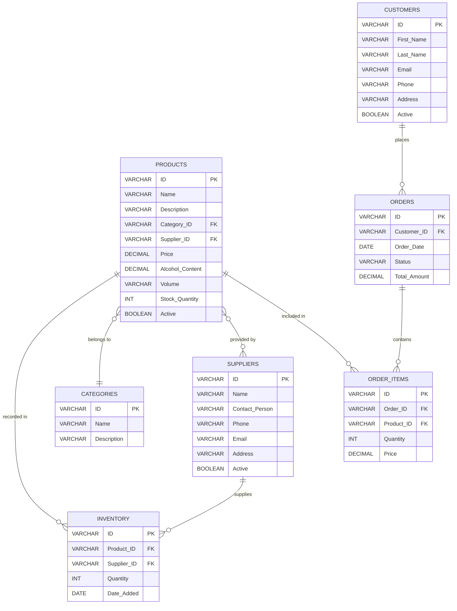

# Practical assignment 3

## Beer Shop Database Schema

This is the database schema for the Beer Shop:

```mermaid
erDiagram
    CUSTOMERS {
        VARCHAR ID PK
        VARCHAR First_Name
        VARCHAR Last_Name
        VARCHAR Email
        VARCHAR Phone
        VARCHAR Address
        BOOLEAN Active
    }

    PRODUCTS {
        VARCHAR ID PK
        VARCHAR Name
        VARCHAR Description
        VARCHAR Category_ID FK
        VARCHAR Supplier_ID FK
        DECIMAL Price
        DECIMAL Alcohol_Content
        VARCHAR Volume
        INT Stock_Quantity
        BOOLEAN Active
    }

    CATEGORIES {
        VARCHAR ID PK
        VARCHAR Name
        VARCHAR Description
    }

    SUPPLIERS {
        VARCHAR ID PK
        VARCHAR Name
        VARCHAR Contact_Person
        VARCHAR Phone
        VARCHAR Email
        VARCHAR Address
        BOOLEAN Active
    }

    ORDERS {
        VARCHAR ID PK
        VARCHAR Customer_ID FK
        DATE Order_Date
        VARCHAR Status
        DECIMAL Total_Amount
    }

    ORDER_ITEMS {
        VARCHAR ID PK
        VARCHAR Order_ID FK
        VARCHAR Product_ID FK
        INT Quantity
        DECIMAL Price
    }

    INVENTORY {
        VARCHAR ID PK
        VARCHAR Product_ID FK
        VARCHAR Supplier_ID FK
        INT Quantity
        DATE Date_Added
    }

    CUSTOMERS ||--o{ ORDERS : "places"
    ORDERS ||--o{ ORDER_ITEMS : "contains"
    PRODUCTS ||--o{ ORDER_ITEMS : "included in"
    PRODUCTS }o--o{ SUPPLIERS : "provided by"
    PRODUCTS }o--|| CATEGORIES : "belongs to"
    PRODUCTS ||--o{ INVENTORY : "recorded in"
    SUPPLIERS ||--o{ INVENTORY : "supplies"
```
